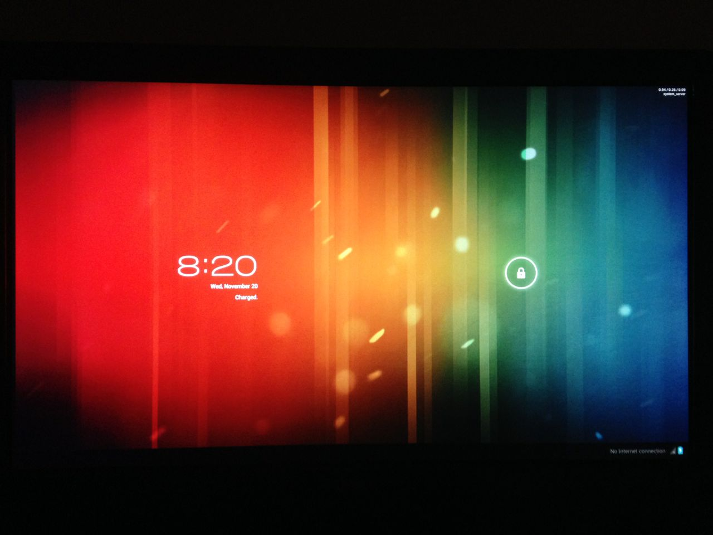
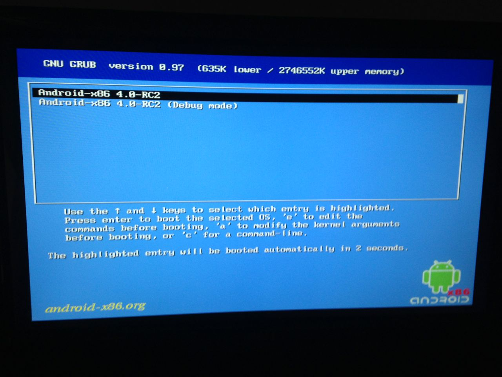
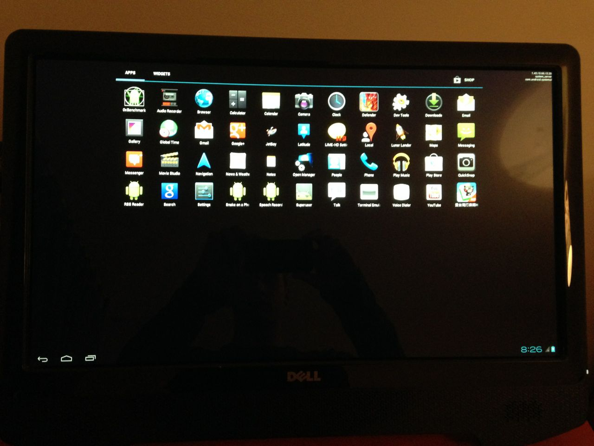
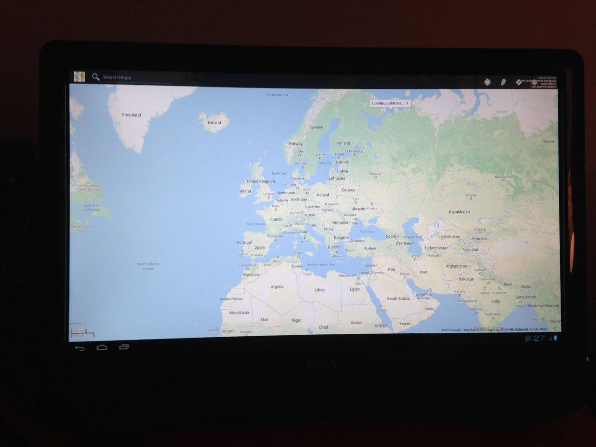
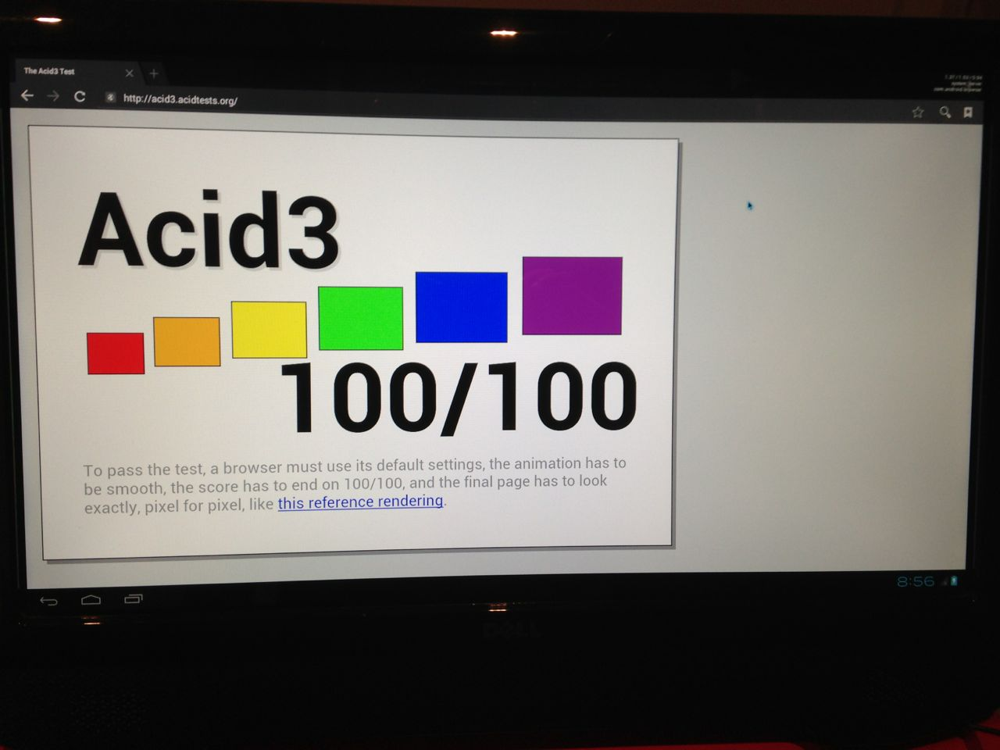
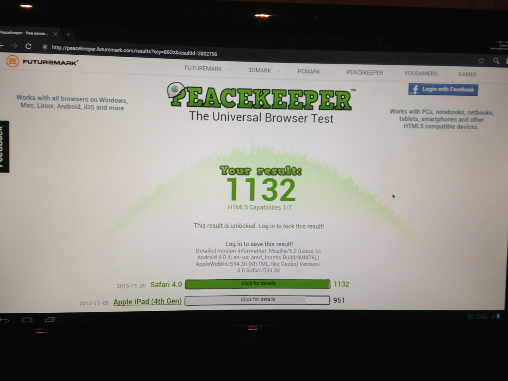
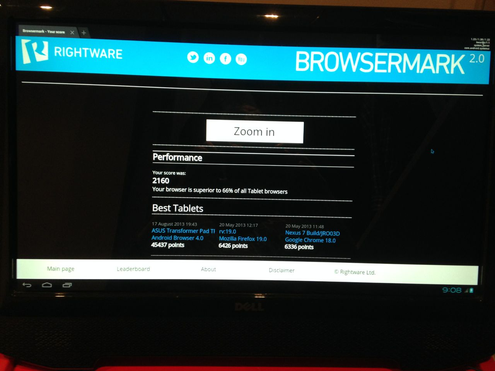

A simple test run of Android x86 on a touch-enabled PC.

---

## Specs

Running [Android-x86 4.0-r1](http://www.android-x86.org/releases/releasenote-4-0-r1) for AMD Brazos platform on the following hardware:

* ASUS E45M1-M PRO
	* AMD E-450 @ 1650 MHz
	* ATI Radeon HD 6320
* 2x4 GB DDR3 1600 MHz (PC-12800) RAM
* Kingston V100 32 GB SATA II SSD
* Dell ST2220T display with 1920x1080 touchscreen (two simultaneous touch points)

## Installation

The setup is pretty straightforward.

There were some issues with Wi-Fi, so I had to use a wired ethernet connection.

To enable the Internet, you need to go to console (`Alr+F1` to open console, `Alt+F7` to close) and  run the command:

    netcfg eth0 up
    netcfg eth0 dhcp
    setprop net.dns1 8.8.8.8

## Tests

The performance is very good and you can even play games.

Touch input only supports a single point touch. I did not found a way to enable any gestures.

I did run a few browser benchmarks with Google Chrome.

The results are pretty high for a mobile platform.

In summary, this looks pretty promising and it could make a great alternative to Windows Embedded and Webconverger if the driver issues will be addressed.
